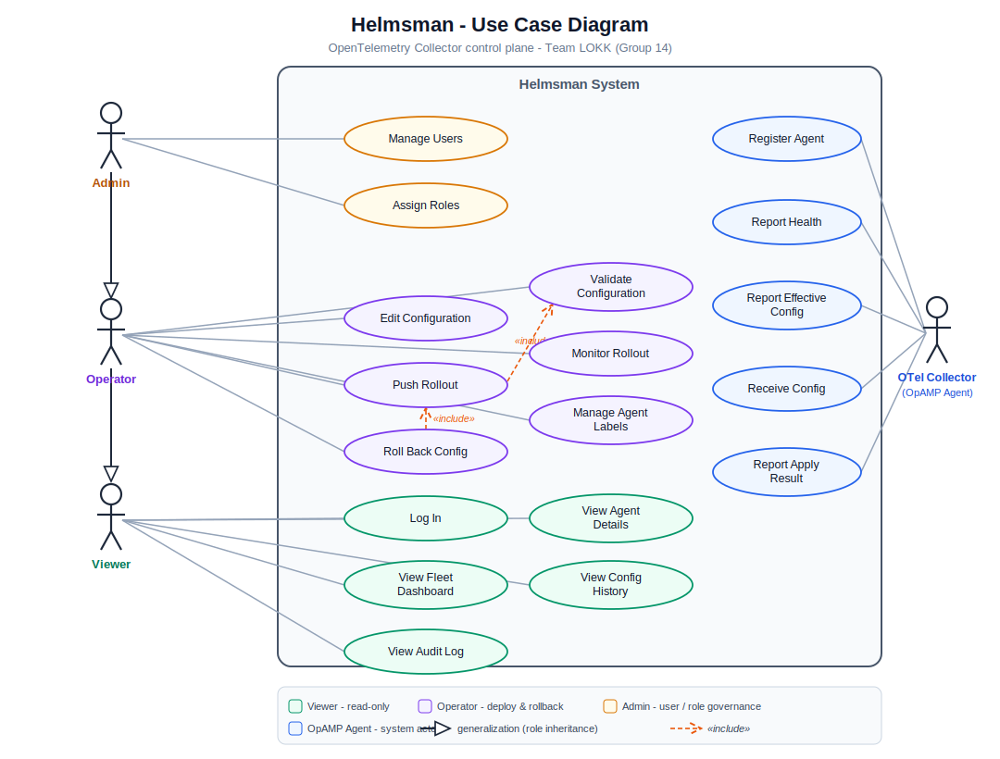
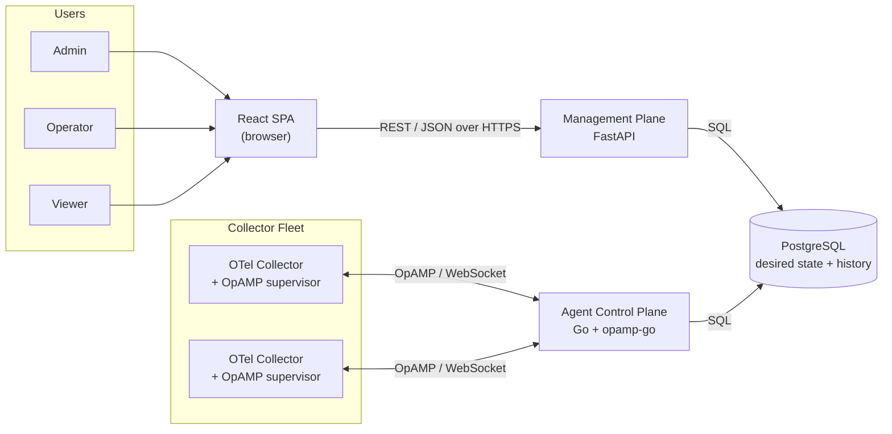
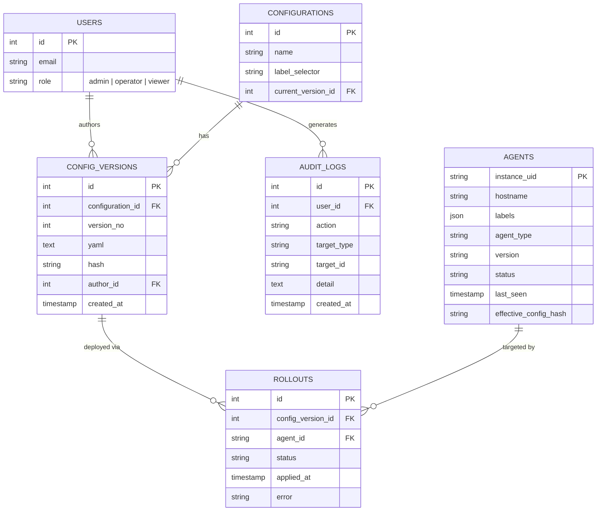

# Assignment 3: Project Description, Use Case Diagram, and Requirements

**Team Name:** LOKK (Group 14)

**Project Name:** Helmsman

---

## 1. Project Description

Helmsman is a self-hostable web application for managing a fleet of OpenTelemetry
(OTel) Collectors from one place. It speaks OpAMP (the Open Agent Management
Protocol) to every collector it manages. Through a single web UI an operator can
see every collector that has checked in, watch its live health and effective
configuration, push a new configuration to one or many collectors, keep a full
version history of every change, and roll back to a previous version with one
click.

The system is split into two cooperating planes that share one database. A Go
agent control plane holds the live OpAMP connections to collectors and reconciles
their running configuration against the desired state. A React and FastAPI
management plane provides the UI, the user-facing API, authentication, and
role-based access control. PostgreSQL is the single source of truth for agents,
configurations, versions, rollouts, users, and audit logs.

Full background, problem statement, and competitor analysis live in the prior
submission: [project-selection.md](project-selection.md).

---

## 2. User Roles (Actors)

Helmsman has three human roles and one external system actor. The three human
roles form a permission hierarchy: an operator can do everything a viewer can
plus deploy work, and an admin can do everything an operator can plus govern
users. This is modeled as actor generalization in the diagram below, so shared
use cases are not redrawn for each role.

| Actor | Type | Description |
|---|---|---|
| Viewer | Human | Read-only access to fleet health, configurations, version history, and the audit log. |
| Operator | Human | Everything a viewer can do, plus edit, validate, push, and roll back configurations and manage agent labels. |
| Admin | Human | Everything an operator can do, plus create and deactivate users and assign roles. |
| OTel Collector (OpAMP Agent) | External system | An OpAMP-compliant collector that registers with Helmsman, reports its health and effective configuration, receives remote configuration, and reports apply results. |

---

## 3. Use Case Diagram

> Rendered diagram above. The editable source is committed alongside it at
> [diagrams/use-case.excalidraw](diagrams/use-case.excalidraw) (open in Excalidraw
> or the Obsidian Excalidraw plugin).

**How to read it.** Solid lines are associations between an actor and a use case.
The hollow triangles on the left are UML generalization: Admin inherits Operator,
which inherits Viewer, so each higher role also has every use case of the roles
below it. Dashed `«include»` arrows show mandatory sub-behavior: pushing a rollout
always includes validating the configuration, and a rollback is performed by
re-pushing a known-good version.

---

## 4. Use Cases by Role (titles)

**Viewer** (also available to Operator and Admin by inheritance)

- Log In
- View Fleet Dashboard
- View Agent Details
- View Configuration History
- View Audit Log

**Operator** (also available to Admin by inheritance)

- Edit Configuration
- Validate Configuration
- Push Rollout
- Monitor Rollout
- Roll Back Configuration
- Manage Agent Labels

**Admin**

- Manage Users
- Assign Roles

**OTel Collector (OpAMP Agent)**

- Register Agent
- Report Health
- Report Effective Config
- Receive Config
- Report Apply Result

---

## 5. Functional Requirements

Requirements are written as atomic "the system shall" statements and grouped by
capability. Each is numbered (FR-x.y) so it can be traced to a use case and, later,
to a test.

### 5.1 Authentication and Access Control

- **FR-1.1** The system shall require users to authenticate before accessing any management function.
- **FR-1.2** The system shall issue a session token on successful authentication and reject expired or invalid tokens.
- **FR-1.3** The system shall assign every user exactly one role: admin, operator, or viewer.
- **FR-1.4** The system shall enforce role-based permissions on every API endpoint and UI action.
- **FR-1.5** The system shall deny any action the user's role is not permitted to perform and record the denied attempt.
- **FR-1.6** The system shall allow an authenticated user to log out and invalidate the current session.

### 5.2 Agent Registry and Fleet Visibility

- **FR-2.1** The system shall accept registration from any OpAMP-compliant collector that connects with valid credentials.
- **FR-2.2** The system shall record each agent's instance UID, hostname, labels, agent type, version, and last-seen timestamp.
- **FR-2.3** The system shall display a fleet dashboard listing every known agent with its current health status (healthy, degraded, disconnected).
- **FR-2.4** The system shall display the effective configuration currently reported by each agent.
- **FR-2.5** The system shall update agent health and status in near real time as OpAMP messages arrive.
- **FR-2.6** The system shall allow a user to open a detail view for a single agent showing its full status, labels, and effective configuration.

### 5.3 Configuration Management

- **FR-3.1** The system shall allow an operator to create a named collector configuration.
- **FR-3.2** The system shall allow an operator to edit the body of a configuration.
- **FR-3.3** The system shall validate configuration syntax and schema before a configuration may be saved or pushed.
- **FR-3.4** The system shall reject an invalid configuration and report the validation errors to the user.
- **FR-3.5** The system shall associate each configuration with a label selector that determines which agents it targets.

### 5.4 Configuration Versioning

- **FR-4.1** The system shall create a new immutable version each time a configuration is saved.
- **FR-4.2** The system shall record the author, timestamp, and content hash of every configuration version.
- **FR-4.3** The system shall display the full version history of any configuration in reverse chronological order.
- **FR-4.4** The system shall allow a user to view and compare the contents of any two versions.

### 5.5 Rollout and Remote Configuration Push

- **FR-5.1** The system shall allow an operator to push a selected configuration version to all agents matching its label selector.
- **FR-5.2** The system shall reconcile desired configuration against each connected agent's effective configuration and push only when they differ.
- **FR-5.3** The system shall deliver configuration to agents over the OpAMP protocol.
- **FR-5.4** The system shall record a per-agent rollout result capturing apply status (pending, applied, failed) and any error message.
- **FR-5.5** The system shall display live rollout progress across the targeted agents.

### 5.6 Rollback

- **FR-6.1** The system shall allow an operator to roll back a configuration to any previous version.
- **FR-6.2** The system shall perform a rollback by re-pushing the selected prior version through the standard rollout path.
- **FR-6.3** The system shall record every rollback as an auditable event.

### 5.7 Audit Logging

- **FR-7.1** The system shall record an audit entry for every configuration change, rollout, rollback, login, and role change.
- **FR-7.2** The system shall capture the acting user, action, target, detail, and timestamp on each audit entry.
- **FR-7.3** The system shall allow authorized users to view and filter the audit log.
- **FR-7.4** The system shall prevent modification or deletion of audit entries.

### 5.8 OpAMP Agent Communication

- **FR-8.1** The system shall maintain a persistent connection with each registered agent.
- **FR-8.2** The system shall receive health, status, and effective-configuration reports from agents.
- **FR-8.3** The system shall send remote configuration to agents and receive the resulting apply status.
- **FR-8.4** The system shall mark an agent as disconnected when its connection is lost and resume tracking when it reconnects.

### 5.9 Search, Filter, and Labeling

- **FR-9.1** The system shall allow users to search and filter agents by hostname, label, status, and agent type.
- **FR-9.2** The system shall allow an operator to add, edit, and remove labels on agents.
- **FR-9.3** The system shall use labels to group agents for targeted configuration rollouts.

### 5.10 User and Role Administration

- **FR-10.1** The system shall allow an admin to create and deactivate user accounts.
- **FR-10.2** The system shall allow an admin to assign and change the role of any user.
- **FR-10.3** The system shall prevent a user from changing their own role.

---

## 6. Non-Functional Requirements

### 6.1 Usability

- **NFR-1.1** The web UI shall present a consistent layout and navigation across all pages.
- **NFR-1.2** A user shall be able to roll back a configuration in no more than three clicks from the agent or configuration view.
- **NFR-1.3** The UI shall surface validation errors and rollout failures with clear, actionable messages.
- **NFR-1.4** The UI shall be usable on standard desktop resolutions of 1280px width and above.

### 6.2 Reliability and Availability

- **NFR-2.1** The control plane shall target 99.5% availability during operation.
- **NFR-2.2** The system shall reconnect to and re-synchronize agents automatically after a control-plane restart.
- **NFR-2.3** The system shall converge each agent to its desired configuration through repeated reconciliation rather than a single best-effort push.
- **NFR-2.4** No configuration change shall be lost on service restart; all desired state shall persist in the database.

### 6.3 Performance

- **NFR-3.1** The fleet dashboard shall load within 2 seconds for fleets of up to 500 agents.
- **NFR-3.2** The system shall begin pushing a configuration to matching connected agents within 5 seconds of an operator confirming a rollout.
- **NFR-3.3** The control plane shall sustain concurrent OpAMP connections for at least 500 agents on a single host.

### 6.4 Scalability

- **NFR-4.1** The architecture shall scale horizontally by adding agent control-plane instances that coordinate through the shared database.
- **NFR-4.2** The data model shall support growth to thousands of agents and configuration versions without schema change.

### 6.5 Security

- **NFR-5.1** All client, API, and OpAMP traffic shall be encrypted in transit with TLS.
- **NFR-5.2** User passwords shall be stored only as salted hashes and shall never be returned by any API.
- **NFR-5.3** The system shall enforce role-based authorization on the server, not only in the UI.
- **NFR-5.4** Audit records shall be append-only and tamper-evident.
- **NFR-5.5** Secrets and credentials shall never be committed to source control or written to logs.

### 6.6 Maintainability and Supportability

- **NFR-6.1** The system shall be fully open source under a permissive license with no feature gates.
- **NFR-6.2** Source code shall be maintained in Git with feature branches and required peer review before merge to main.
- **NFR-6.3** The management API shall expose auto-generated, browsable API documentation.
- **NFR-6.4** The system shall emit structured logs for key operations to support troubleshooting.

### 6.7 Portability and Deployment

- **NFR-7.1** The system shall run on a single host via container images orchestrated with Docker Compose.
- **NFR-7.2** The system shall run without dependency on any proprietary or hosted third-party service.

### 6.8 Design Constraints

- **NFR-8.1** The system shall manage agents using the open OpAMP protocol and shall not require a proprietary forked agent.
- **NFR-8.2** The system shall target the OpenTelemetry Collector as the managed agent.
- **NFR-8.3** The implementation shall use the agreed stack: React, FastAPI, Go (opamp-go), and PostgreSQL.

### 6.9 External Interfaces

- **NFR-9.1** The system shall provide a browser-based user interface as the primary human interface.
- **NFR-9.2** The system shall provide a documented REST and JSON API for all management operations.
- **NFR-9.3** The system shall communicate with agents over the OpAMP WebSocket interface.

---

## 7. System Architecture and Technology Stack

### 7.1 Architecture Overview

Helmsman uses a two-plane architecture coordinated through a shared PostgreSQL
database. The management plane writes *desired state* (a configuration version
targeted at a set of agents). The agent control plane *reconciles* that desired
state against what each connected collector is actually running: when an agent's
effective configuration differs from the desired one, it pushes the new config
over OpAMP and writes back the apply result. This is the same declarative
reconciler pattern used by a Kubernetes controller, and it lets the two services
coordinate through the database instead of brittle direct calls.

### 7.2 Technology Choices

| Layer | Technology | Why |
|---|---|---|
| Front end | React + Vite + TypeScript | Team selected React; component model fits a dashboard with many reusable views; TypeScript adds type safety; Vite gives a fast dev loop. |
| Management back end | FastAPI (Python) | Chosen over Flask for async performance, automatic OpenAPI/Swagger docs, and Pydantic validation that fits configuration-schema checking. Team is comfortable in Python. |
| Agent control plane | Go + opamp-go | opamp-go is the reference OpAMP server library; Go handles thousands of concurrent persistent WebSocket connections efficiently. Reuses prior internship work. |
| Database | PostgreSQL | Relational integrity for users, configs, versions, rollouts, and audit; ACID guarantees for versioning and append-only audit; JSONB for flexible labels and config metadata; mature and open source. |
| Authentication | JWT-based sessions | Stateless tokens that both planes can validate; simple to enforce RBAC per request. |
| Deployment | Docker + Docker Compose | Single-host, self-hosted deployment with no proprietary dependencies. |
| Managed agent | OpenTelemetry Collector + OpAMP supervisor | The open standard the product is built around; any OpAMP-compliant collector can connect. |

### 7.3 Data Model

PostgreSQL is the single source of truth. Six core entities satisfy the database
requirement and back the use cases above.

---

## 8. Contributions

> Placeholder for the per-assignment contribution statement required by the
> syllabus. Confirm and edit before submitting.

- **Use Case Diagram:** Kristie Richards, D'Andre Kennedy
- **Functional and Non-Functional Requirements:** Liam Ellison
- **Architecture and Technology Stack:** Liam Ellison
- **Review and submission:** Obaid Younus and full team

---

## Sources

- [project-selection.md](project-selection.md) - project background, problem, competitor, and initial architecture
- [team-info-and-contract.md](team-info-and-contract.md) - team roles and version-control workflow
- [SRS 4.0 example] and https://jelvix.com/blog/software-requirements-specification - requirements-format references from the assignment
- Meeting notes, 16 Jun 2026 - stack and role decisions
