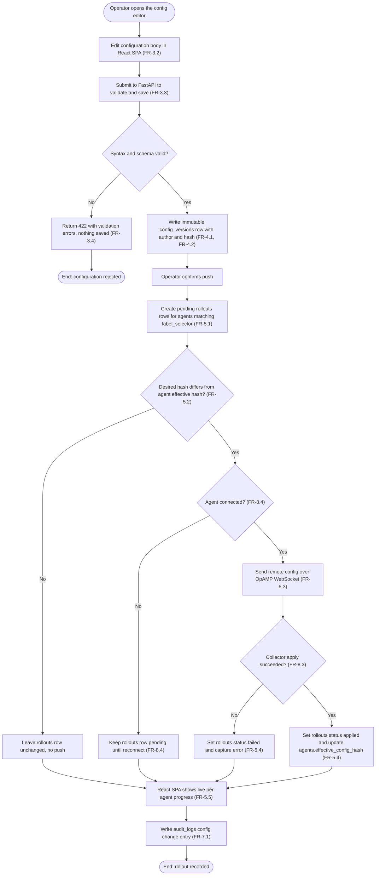
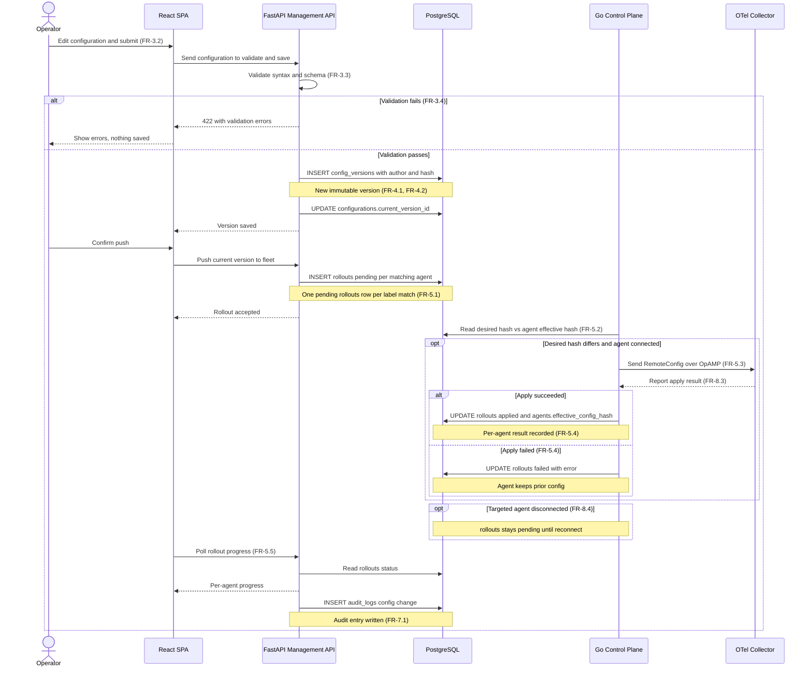
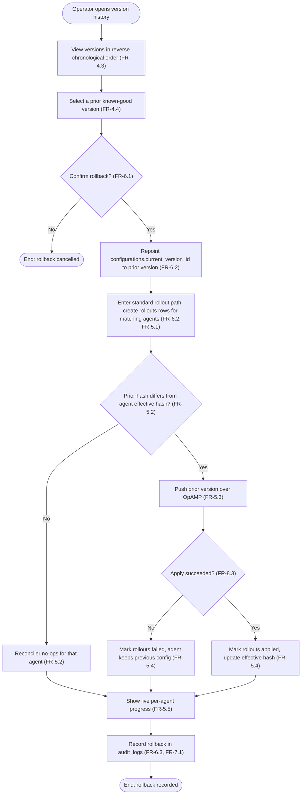
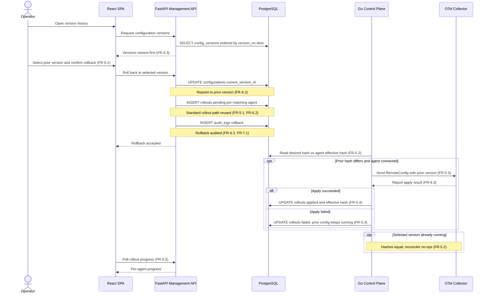
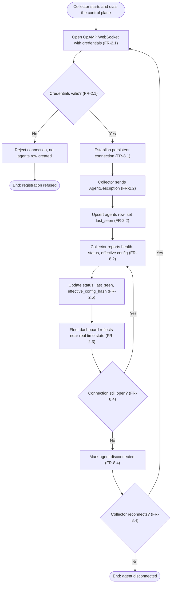
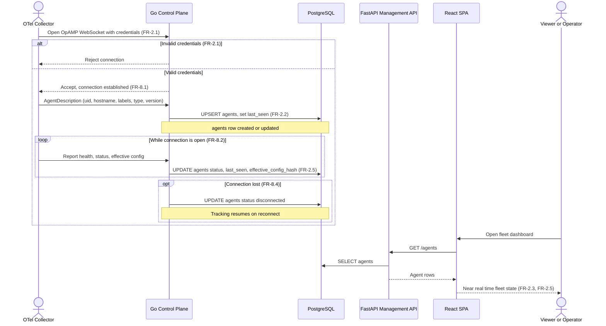

# Assignment 5: Use Cases and Sequence Diagrams

**Team Name:** LOKK (Group 14)

**Project Name:** Helmsman

---

## 1. Purpose and How to Read This Document

This submission documents the three most important use cases in Helmsman and
the object interactions behind each one.
Helmsman is a self-hostable web application that manages a fleet of
OpenTelemetry Collectors over OpAMP, so the use cases we chose are the ones
that exercise the whole system end to end: pushing a new configuration to the
fleet, rolling a configuration back to a known-good version, and an agent
registering and reporting its health.

Each use case is presented in three parts, in the order the assignment brief
recommends.
First a fully dressed use case specification gives the actors, goal,
preconditions, the main success scenario as numbered steps, and the extensions
that branch off those steps.
Second an activity diagram (a flowchart) is the intermediate step that models
the actions and decisions the task requires before the objects are pinned
down.
Third a sequence diagram shows the same scenario as messages between the real
architecture components, so the flowchart's abstract actions become concrete
calls between named objects.

**How to read the diagrams.**
In the activity diagrams, rounded nodes are start and end points, rectangles
are actions, and diamonds are decisions with every branch labeled.
In the sequence diagrams, participants are the architecture components from
section 7.1 of the requirements submission, a solid arrow is a request or a
send, and a dashed arrow is a reply.
Notes over a participant and the database name the exact table that is written.
Requirement ids (FR-x.y) are carried inline and collected in the traceability
table in section 6, and each id traces to the functional requirements in
[requirements-and-use-cases.md](requirements-and-use-cases.md).

---

## 2. Actors and Participating Objects

Every sequence diagram in this document draws its participants from the same
set: the two human actors, the external collector actor, and the four system
components of the two-plane architecture.
The table maps each participant to its architecture component and the database
tables it touches.
Column and table names match [data-model.md](data-model.md) exactly.

| Participant | Kind | Architecture Component | Responsibility in the Diagrams | Database Tables Touched |
|---|---|---|---|---|
| Operator | Actor (human) | Operator role in the RBAC hierarchy | Edits configurations, confirms pushes, and initiates rollbacks | None directly; acts through the React SPA |
| Viewer or Operator | Actor (human) | Any authenticated dashboard observer | Opens the fleet dashboard to watch live agent state | None directly; reads through the management API |
| React SPA | Object | React and Vite front end in the browser | Renders the editor, dashboard, and rollout progress; calls the management API | None directly; all persistence goes through the API |
| FastAPI Management API | Object | Management plane, port 8000 | Validates configs, writes versions, fans out rollouts, serves reads, writes audit entries | configurations, config_versions, rollouts, audit_logs (writes); users, agents (reads) |
| PostgreSQL | Object | Shared source of truth | Stores all desired state, history, and audit records | users, agents, configurations, config_versions, rollouts, audit_logs |
| Go Control Plane | Object | Agent control plane, Go and opamp-go, port 4320 | Holds OpAMP connections, reconciles desired against effective state, pushes config, records apply results and health | agents (upsert and update); rollouts (update); config_versions (read desired) |
| OTel Collector | Actor (external system) | OpAMP-compliant collector in the fleet | Registers, reports health and effective config, applies remote config, reports apply results | None; speaks OpAMP to the control plane, never the database |

---

## 3. Use Case UC-1: Push Configuration Rollout

### Use Case Specification

| Field | Detail |
|---|---|
| ID | UC-1 |
| Name | Push Configuration Rollout |
| Primary Actor | Operator |
| Supporting Actors | OTel Collector (OpAMP Agent), Go Agent Control Plane |
| Goal | Deploy a new collector configuration version to every agent matching the configuration's label selector, and confirm the apply result for each agent. |
| Preconditions | The operator is authenticated with a valid token (FR-1.1); the operator role permits push (FR-1.4); at least one agent is registered; the configuration carries a label selector (FR-3.5). |
| Trigger | The operator saves an edited configuration and confirms the push in the UI. |
| Main Success Scenario | 1. The operator edits the configuration body in the React SPA and submits it (FR-3.2).  2. The FastAPI management plane validates the configuration syntax and schema (FR-3.3).  3. FastAPI writes a new immutable config_versions row with the author, timestamp, and content hash, then advances configurations.current_version_id (FR-4.1, FR-4.2).  4. The operator confirms the push.  5. FastAPI creates one pending rollouts row for each agent whose labels match the configuration label_selector (FR-5.1, FR-3.5).  6. The Go control plane reconciles desired against effective state and sends the remote configuration over OpAMP to each connected agent whose effective_config_hash differs (FR-5.2, FR-5.3).  7. Each OTel Collector applies the configuration and reports its apply result (FR-8.3).  8. The control plane sets the agent's rollouts row to applied and updates agents.effective_config_hash (FR-5.4).  9. The React SPA shows live per-agent rollout progress (FR-5.5).  10. FastAPI records an audit_logs entry for the configuration change (FR-7.1). |
| Extensions | 2a. Validation fails: FastAPI returns 422 with the errors, the SPA shows them, and no version is written or pushed (FR-3.4).  6a. A targeted agent is disconnected: its rollouts row stays pending and the control plane pushes on reconnect (FR-8.4).  7a. The collector fails to apply: the control plane sets the rollouts row to failed with the error, the SPA surfaces it, and the agent keeps its prior configuration (FR-5.4). |
| Postconditions | A new immutable version exists and is the current version; every targeted connected agent runs it with an applied rollouts row; disconnected or failed agents are recorded as pending or failed; an audit entry exists. |
| Related Requirements | FR-1.1, FR-1.4, FR-3.2, FR-3.3, FR-3.4, FR-3.5, FR-4.1, FR-4.2, FR-5.1, FR-5.2, FR-5.3, FR-5.4, FR-5.5, FR-7.1, FR-8.3, FR-8.4 |

### Activity Diagram

*Figure UC-1a. Activity diagram for pushing a configuration rollout.*

### Sequence Diagram

*Figure UC-1b. Sequence diagram for pushing a configuration rollout.*

### Narration

The push starts in the React SPA and is gated by validation in the management
plane, so an invalid config is rejected with a 422 and never reaches the
database (FR-3.3, FR-3.4).
A clean config becomes an immutable config_versions row that records its author
and content hash (FR-4.1, FR-4.2), which is what later makes versioning and
rollback possible.
The management plane only fans out pending rollouts rows against the agents the
label selector matches (FR-5.1); it does not talk to collectors itself.
The Go control plane owns that step: it compares the desired hash against each
agent's effective hash and pushes over OpAMP only where they differ, which is
the reconciler behavior in FR-5.2 and FR-5.3.
Per-agent apply results (FR-5.4) drive the live progress the operator watches
(FR-5.5), and the whole change lands as one audit entry (FR-7.1).
The two extensions that survive a bad day, a disconnected agent staying pending
(FR-8.4) and a failed apply leaving the prior config running (FR-5.4), are the
reason the rollout is tracked per agent rather than as one fleet-wide result.

---

## 4. Use Case UC-2: Roll Back Configuration

### Use Case Specification

| Field | Detail |
|---|---|
| ID | UC-2 |
| Name | Roll Back Configuration |
| Primary Actor | Operator |
| Supporting Actors | OTel Collector (OpAMP Agent), Go Agent Control Plane |
| Goal | Restore a known-good prior configuration version by re-pushing it through the standard rollout path. |
| Preconditions | The operator is authenticated (FR-1.1) with push permission (FR-1.4); the configuration has at least one prior version in its history. |
| Trigger | The operator selects a prior version from the history and confirms the rollback. |
| Main Success Scenario | 1. The operator opens the configuration version history, listed in reverse chronological order (FR-4.3).  2. The operator selects a prior known-good version and may compare it against the current one (FR-4.4).  3. The operator confirms the rollback (FR-6.1).  4. FastAPI repoints configurations.current_version_id to the selected prior version (FR-6.2).  5. The standard rollout path runs: FastAPI creates pending rollouts rows for matching agents and the control plane reconciles and pushes the prior version over OpAMP (FR-6.2, FR-5.1, FR-5.2, FR-5.3).  6. Agents apply and report; per-agent rollouts rows are updated and live progress is shown (FR-5.4, FR-5.5, FR-8.3).  7. FastAPI records the rollback in audit_logs (FR-6.3, FR-7.1). |
| Extensions | 5a. The selected version already matches an agent's effective hash: the reconciler no-ops for that agent (FR-5.2).  5b. A push fails on an agent: its rollouts row is marked failed and it keeps its previous configuration; other agents are unaffected (FR-5.4). |
| Postconditions | configurations.current_version_id points at the restored version; targeted connected agents run it; the rollback is recorded in the audit log. |
| Related Requirements | FR-1.1, FR-1.4, FR-4.3, FR-4.4, FR-5.1, FR-5.2, FR-5.3, FR-5.4, FR-5.5, FR-6.1, FR-6.2, FR-6.3, FR-7.1, FR-8.3 |

### Activity Diagram

*Figure UC-2a. Activity diagram for rolling a configuration back.*

### Sequence Diagram

*Figure UC-2b. Sequence diagram for rolling a configuration back.*

### Narration

Rollback is deliberately not a special code path.
The operator reads the version history newest first (FR-4.3), optionally
compares two versions (FR-4.4), and confirms restoring a prior one (FR-6.1).
The only rollback-specific action is repointing
configurations.current_version_id at that older version (FR-6.2); from there the
sequence reuses the exact rollout path UC-1 already draws, which is why the
diagram references those steps instead of redrawing them.
That reuse is the design fact behind FR-6.2: a rollback is just a push of a
known-good version, so it inherits reconciliation (FR-5.2), OpAMP delivery
(FR-5.3), per-agent results (FR-5.4), and live progress (FR-5.5) for free.
The rollback is logged as its own audited event (FR-6.3, FR-7.1), and the two
extensions keep it safe: if an agent already runs the target version the
reconciler no-ops (FR-5.2), and if a push fails that agent keeps its previous
config while the rest of the fleet proceeds (FR-5.4).

---

## 5. Use Case UC-3: Register Agent and Report Health

### Use Case Specification

| Field | Detail |
|---|---|
| ID | UC-3 |
| Name | Register Agent and Report Health |
| Primary Actor | OTel Collector (OpAMP Agent), an external system actor |
| Supporting Actors | Go Agent Control Plane; Viewer or Operator observing the dashboard |
| Goal | Register the collector with Helmsman over OpAMP and keep its health, status, and effective configuration current in near real time. |
| Preconditions | The control plane is listening for OpAMP connections on port 4320; the collector has valid credentials. There is no human in the loop for the main flow. |
| Trigger | The OTel Collector opens an OpAMP WebSocket connection to the control plane. |
| Main Success Scenario | 1. The collector opens an OpAMP WebSocket connection presenting valid credentials (FR-2.1).  2. The control plane accepts and holds the persistent connection (FR-8.1).  3. The collector sends its AgentDescription: instance UID, hostname, labels, agent type, and version (FR-2.2).  4. The control plane upserts the agents row and sets last_seen (FR-2.2).  5. Over the persistent connection the collector reports health, status, and effective configuration (FR-8.2, FR-2.4).  6. The control plane updates the agents row status, last_seen, and effective_config_hash (FR-2.5).  7. The React SPA fleet dashboard, reading through the management API, reflects the agent's near real time state (FR-2.3, FR-2.5). |
| Extensions | 1a. Invalid credentials: the control plane rejects the connection and no agents row is created (FR-2.1).  5a. The connection is lost: the control plane marks the agent disconnected and resumes tracking, updating the row, when it reconnects (FR-8.4). |
| Postconditions | An agents row exists with the collector identity and its latest reported health, status, and effective_config_hash; the dashboard shows the agent. |
| Related Requirements | FR-2.1, FR-2.2, FR-2.3, FR-2.4, FR-2.5, FR-8.1, FR-8.2, FR-8.4 |

### Activity Diagram

*Figure UC-3a. Activity diagram for agent registration and health reporting.*

### Sequence Diagram

*Figure UC-3b. Sequence diagram for agent registration and health reporting.*

### Narration

This use case has no human initiator: the collector itself is the primary
actor, and the control plane is the only Helmsman component that ever holds an
OpAMP connection (FR-8.1).
Registration is credential-gated, so an agent with bad credentials is rejected
and leaves no row (FR-2.1), while a valid one is captured by a single upsert of
the agents row keyed on the instance UID (FR-2.2).
Health, status, and effective configuration then flow continuously on the same
persistent connection (FR-8.2), and each report refreshes status, last_seen,
and effective_config_hash so the fleet view is current (FR-2.5).
The dashboard read is drawn separately and routed through the management API,
which is faithful to the two-plane architecture: the control plane writes agent
state, and the SPA reads it back through FastAPI (FR-2.3).
The disconnected extension (FR-8.4) is what keeps the dashboard honest when a
collector drops off, and the effective_config_hash written here is the same
value UC-1 and UC-2 compare against to decide whether a push is needed.

---

## 6. Requirements Traceability

Each use case is traced to the functional requirements it exercises. Ids are
defined in section 5 of
[requirements-and-use-cases.md](requirements-and-use-cases.md).

| Use Case | Functional Requirements Covered |
|---|---|
| UC-1 Push Configuration Rollout | FR-1.1, FR-1.4, FR-3.2, FR-3.3, FR-3.4, FR-3.5, FR-4.1, FR-4.2, FR-5.1, FR-5.2, FR-5.3, FR-5.4, FR-5.5, FR-7.1, FR-8.3, FR-8.4 |
| UC-2 Roll Back Configuration | FR-1.1, FR-1.4, FR-4.3, FR-4.4, FR-5.1, FR-5.2, FR-5.3, FR-5.4, FR-5.5, FR-6.1, FR-6.2, FR-6.3, FR-7.1, FR-8.3 |
| UC-3 Register Agent and Report Health | FR-2.1, FR-2.2, FR-2.3, FR-2.4, FR-2.5, FR-8.1, FR-8.2, FR-8.4 |

---

## Sources

- [requirements-and-use-cases.md](requirements-and-use-cases.md) - functional
  requirement ids, actor roles, and the section 7.1 architecture that names
  the sequence diagram participants
- [data-model.md](data-model.md) - entity, table, and column names
  used in the database notes
- Assignment brief: [use-cases-and-sequence-diagrams.md](../instructions/use-cases-and-sequence-diagrams.md) -
  the assignment 5 instructions, including the activity diagram intermediate
  step and the sequence diagram examples
