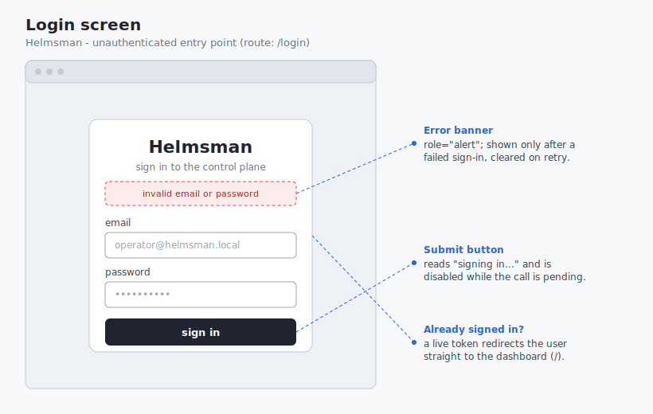
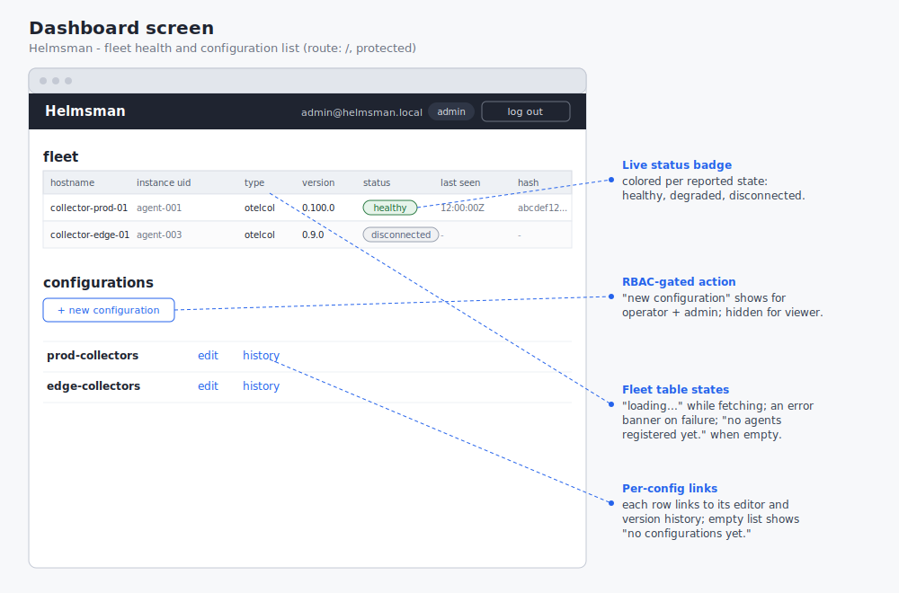
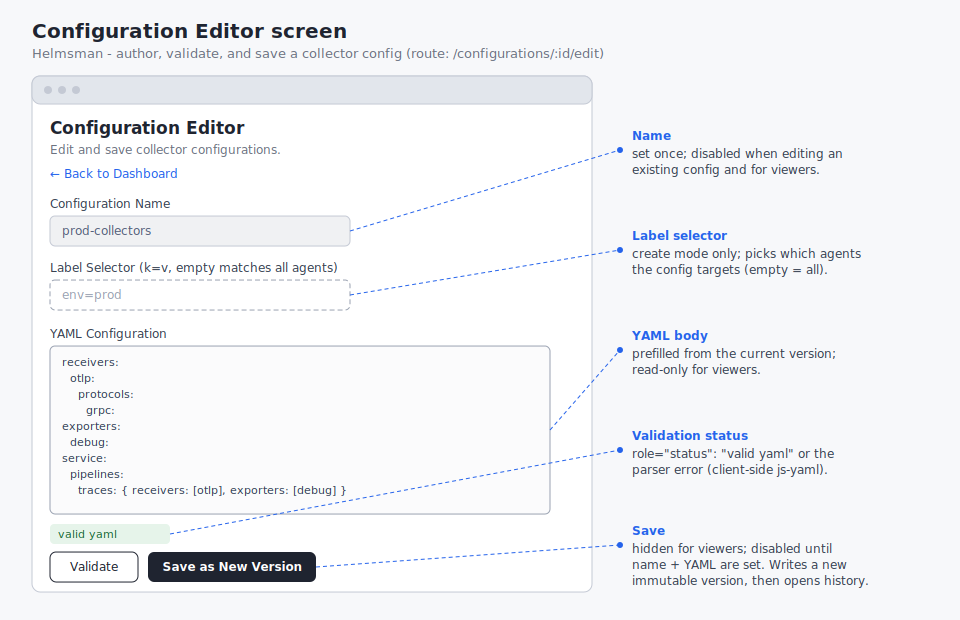
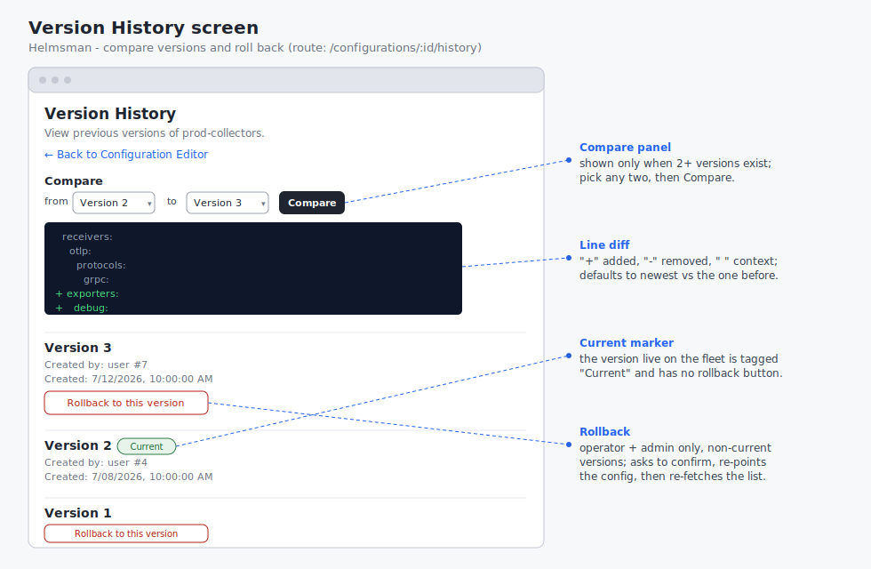
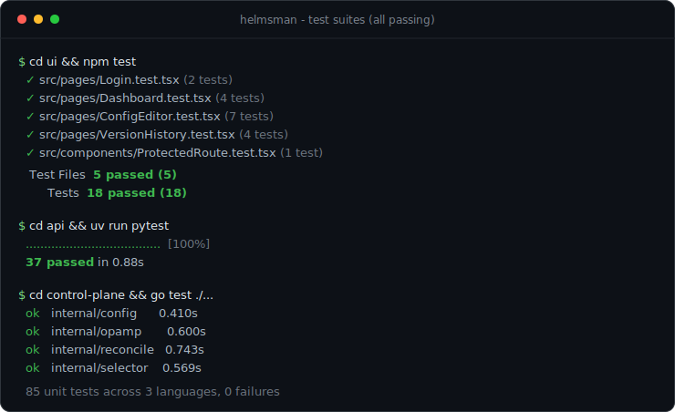

# Assignment 6: Wireframes, Test Scenarios, and Test Cases

**Team Name:** LOKK (Group 14)

**Project Name:** Helmsman

---

## 1. Purpose and How to Read This Document

Helmsman is a self-hosted control plane for OpenTelemetry Collector fleets.
The management surface is a single-page React application with four screens
behind a login gate: the login screen, the fleet dashboard, the configuration
editor, and the version history view.
This submission documents those screens as annotated wireframes, describes six
testing scenarios in which a user completes a task, and maps every scenario to
the automated unit tests that verify it.

The unit tests referenced here already live in the repository and run on every
pull request through GitHub Actions
([.github/workflows/ci.yaml](../../.github/workflows/ci.yaml)).
Section 6 gives the commands to run them locally and the results of the most
recent run.

**How to read the wireframes.**
Each wireframe shows one screen inside a browser frame, with the real element
labels from the implementation.
Blue callouts with dashed leader lines annotate the elements whose behavior is
conditional: role-based access control (RBAC) gating, loading and error and
empty states, and validation feedback.

**How to read the scenarios and test cases.**
Each scenario in section 3 is a short, numbered walk-through of a user
completing a single task, in the style of the assignment brief.
Section 4 maps each scenario to the specific unit test or tests that exercise
the same path, named by file and test description and linked to the source.
Requirement ids (FR-x.y) are collected in the traceability table in section 5
and trace to the functional requirements in
[requirements-and-use-cases.md](requirements-and-use-cases.md).

---

## 2. The Screens (Wireframes)

The four screens correspond one-to-one to the routed pages in
[ui/src/pages](../../ui/src/pages).
Every screen except the login gate is protected: an unauthenticated visitor is
redirected to the login screen (FR-1.1).

### 2.1 Login



The entry point at `/login`.
The user enters an email and password and submits.
On success the session token is stored and the app navigates to the dashboard;
on failure an error banner appears and no token is stored.
A user who already holds a valid token is redirected straight to the dashboard.

### 2.2 Fleet Dashboard



The landing screen at `/` after sign-in.
The top section is the live fleet table: one row per registered agent showing
hostname, instance uid, type, version, a colored health-status badge, last-seen
time, and effective config hash (FR-2.3, FR-2.4).
The lower section lists the collector configurations, each linking to its editor
and its version history.
The "new configuration" action is shown only to operators and admins; it is
hidden from viewers (FR-1.4).
The table has three non-data states: a loading placeholder, an error banner,
and an empty-fleet message.

### 2.3 Configuration Editor



Reached at `/configurations/:id/edit` (or `/configurations/new/edit`).
The operator edits the collector YAML, clicks Validate to check the syntax
client-side, and clicks Save as New Version to persist an immutable version
(FR-3.2, FR-3.3, FR-4.1).
The name is fixed once a configuration exists, and the label selector is offered
only when creating a new configuration.
For viewers the body is read-only and the Save action is hidden (FR-1.4).

### 2.4 Version History



Reached at `/configurations/:id/history`.
Versions are listed newest first, with the live version tagged "Current"
(FR-4.3).
The compare panel, shown when at least two versions exist, renders a line diff
between any two selected versions (FR-4.4).
Operators and admins get a rollback control on every non-current version; it
asks for confirmation, re-points the configuration to that version, and
re-fetches the list (FR-6.1, FR-6.2).

---

## 3. Test Scenarios

Six scenarios follow, which exceeds the required four and covers all four
screens.
Each describes a user completing one task.

### Scenario S1: Sign in with valid credentials

1. The user opens the application and is shown the login screen.
2. The user types a valid email and password.
3. The user clicks Sign in.
4. The system authenticates the user, stores the session token, and navigates
   to the fleet dashboard.

### Scenario S2: Sign in is rejected for bad credentials

1. The user opens the login screen.
2. The user types an unknown email and a wrong password.
3. The user clicks Sign in.
4. The system rejects the attempt, shows an error banner with the reason, and
   leaves the user signed out with no token stored.

### Scenario S3: Review live fleet health and configurations

1. An authenticated user opens the dashboard.
2. The system loads and displays every registered agent with its hostname and
   current health status (healthy, disconnected).
3. The system displays the list of configurations, each with an edit link and a
   history link.
4. The user reads the fleet state and quits.

### Scenario S4: A viewer is prevented from changing configurations

1. A user with the viewer role signs in and opens the dashboard.
2. The system hides the "new configuration" action from the viewer.
3. The viewer opens a configuration in the editor.
4. The system presents the YAML as read-only and hides the Save action, so the
   viewer can look but cannot change or push anything.

### Scenario S5: Author, validate, and save a configuration

1. An operator opens the configuration editor.
2. The operator edits the YAML and clicks Validate; the system reports a syntax
   error for a malformed body.
3. The operator corrects the YAML and clicks Validate again; the system reports
   the YAML as valid.
4. The operator clicks Save as New Version; the system stores a new immutable
   version and navigates to the version history.

### Scenario S6: Compare two versions and roll back

1. An operator opens the version history for a configuration.
2. The system lists the versions newest first and marks the current one.
3. The operator selects two versions and clicks Compare; the system shows a
   line diff of the two bodies.
4. The operator clicks Rollback on a prior version and confirms; the system
   re-points the configuration to that version and refreshes the history.

---

## 4. Test Cases

Every scenario is verified by at least one automated unit test that drives the
same path.
The UI tests use **Vitest** with **React Testing Library**, which interacts
with each screen the way a user does: querying by accessible role and label,
typing, and clicking, rather than reaching into implementation details.
Network calls are mocked at the API-client boundary so each test isolates the
screen under test.

| Scenario | Unit test that verifies it (file › description) | Framework |
|---|---|---|
| S1 Sign in (valid) | [Login.test.tsx › submits credentials and stores the token via login then getMe](../../ui/src/pages/Login.test.tsx#L31) | Vitest + React Testing Library |
| S2 Sign in (rejected) | [Login.test.tsx › shows an error banner when login raises an ApiError](../../ui/src/pages/Login.test.tsx#L62) | Vitest + React Testing Library |
| S3 Review fleet | [Dashboard.test.tsx › renders the mocked agents with their status text](../../ui/src/pages/Dashboard.test.tsx#L74) and [› lists configurations with edit and history links](../../ui/src/pages/Dashboard.test.tsx#L92) | Vitest + React Testing Library |
| S4 Viewer RBAC | [Dashboard.test.tsx › hides the new configuration link from viewers but shows it to operators](../../ui/src/pages/Dashboard.test.tsx#L134) and [ConfigEditor.test.tsx › disables the textarea and hides the save button for viewers](../../ui/src/pages/ConfigEditor.test.tsx#L218) | Vitest + React Testing Library |
| S5 Author + validate + save | [ConfigEditor.test.tsx › validates good yaml and reports a parse error for bad yaml](../../ui/src/pages/ConfigEditor.test.tsx#L146) and [› saves a new version in edit mode and navigates to the history route](../../ui/src/pages/ConfigEditor.test.tsx#L163) | Vitest + React Testing Library |
| S6 Compare + rollback | [VersionHistory.test.tsx › renders a diff with a "+ exporters:" line for the two default versions](../../ui/src/pages/VersionHistory.test.tsx#L115) and [› hides rollback for viewers and rolls back a non-current version for operators](../../ui/src/pages/VersionHistory.test.tsx#L129) | Vitest + React Testing Library |

The scenarios above are user-facing and are tested at the UI layer.
The same behaviors are enforced and independently tested at the API layer with
**pytest** and the FastAPI TestClient, so the guarantee holds server-side and
not only in the browser:

| Scenario | Supporting server-side test |
|---|---|
| S1 | [test_auth.py › test_login_success_returns_token_and_user](../../api/tests/test_auth.py) |
| S2 | [test_auth.py › test_login_wrong_password_401, test_login_unknown_email_401](../../api/tests/test_auth.py) |
| S4 | [test_configurations.py › test_create_configuration_as_viewer_403, test_create_version_as_viewer_403](../../api/tests/test_configurations.py) |
| S5 | [test_configurations.py › test_create_version_invalid_yaml_400, test_create_version_increments_and_sets_current](../../api/tests/test_configurations.py) |
| S6 | [test_configurations.py › test_rollback_flips_pointer_and_audits, test_versions_list_newest_first](../../api/tests/test_configurations.py) |

For illustration, this is the complete unit test for scenario S2.
It renders the login screen, types bad credentials, clicks Sign in, and asserts
that the error banner appears and no token is written:

```tsx
it('shows an error banner when login raises an ApiError', async () => {
  vi.mocked(api.login).mockRejectedValue(
    new api.ApiError(401, 'invalid email or password'),
  )

  const user = userEvent.setup()
  renderLogin()

  await user.type(screen.getByLabelText('email'), 'bad@helmsman.local')
  await user.type(screen.getByLabelText('password'), 'nope')
  await user.click(screen.getByRole('button', { name: /sign in/i }))

  const banner = await screen.findByRole('alert')
  expect(banner).toHaveTextContent('invalid email or password')
  expect(localStorage.getItem('helmsman.token')).toBeNull()
})
```

---

## 5. Requirements Traceability

Each scenario is traced to the functional requirements it exercises.
Ids are defined in
[requirements-and-use-cases.md](requirements-and-use-cases.md).

| Scenario | Screen(s) | Functional Requirements |
|---|---|---|
| S1 Sign in (valid) | Login | FR-1.1, FR-1.2 |
| S2 Sign in (rejected) | Login | FR-1.1, FR-1.2, NFR-1.3 |
| S3 Review fleet | Dashboard | FR-1.1, FR-2.3, FR-2.4 |
| S4 Viewer RBAC | Dashboard, Config Editor | FR-1.3, FR-1.4, FR-1.5 |
| S5 Author + validate + save | Config Editor | FR-3.1, FR-3.2, FR-3.3, FR-3.4, FR-4.1, FR-4.2 |
| S6 Compare + rollback | Version History | FR-4.3, FR-4.4, FR-6.1, FR-6.2, FR-6.3 |

---

## 6. Running the Tests and Results

The suites run with a single command per layer, from the repository root:

```sh
cd ui && npm install && npm test          # UI: Vitest + React Testing Library
cd api && uv sync && uv run pytest         # API: pytest + FastAPI TestClient
cd control-plane && go test ./...          # control plane: go test
```

The API tests need no database or Docker: they run against in-memory SQLite
through a FastAPI dependency override, so the whole suite is self-contained.

Results of the most recent run (all green):

| Suite | Framework | Result |
|---|---|---|
| UI | Vitest + React Testing Library | 18 passed (5 files) |
| API | pytest + FastAPI TestClient | 37 passed |
| Control plane | go test | all packages ok (config, opamp, reconcile, selector) |

The eighteen UI tests include the ten that back the six scenarios above; the
remaining eight cover adjacent paths on the same screens (empty states, save
failures, route protection).



These same commands run in CI on every pull request, so the scenarios stay
verified as the code changes.

---

## Sources

- [requirements-and-use-cases.md](requirements-and-use-cases.md) - functional
  requirement ids and role definitions cited in sections 2, 3, and 5
- [use-cases-and-sequence-diagrams.md](use-cases-and-sequence-diagrams.md) -
  the push, rollback, and register use cases these scenarios exercise from the
  user's side
- UI test suites under [ui/src](../../ui/src): the Vitest and React Testing
  Library tests mapped in section 4
- API test suites under [api/tests](../../api/tests): the pytest coverage of
  the same behaviors at the server
- Assignment brief:
  [wireframes-test-scenarios-and-test-cases.md](../instructions/wireframes-test-scenarios-and-test-cases.md)
